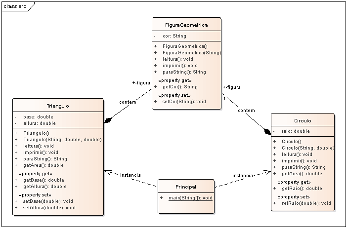

# Exemplo de composição em Java.

## Contextualização

- Exemplo de implementação de composição em Java.
- O projeto modela as classes referentes a objetos geométricos Triângulo e Círculo.
- Triângulo e Círculo tem um objeto da classe Figura Geométrica.
- O programa Principal usa objetos da classe Triângulo e Círculo.

## Diagrama de classe

